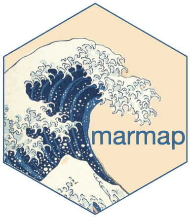

# marmap 

<!-- badges: start -->
[](https://cran.r-project.org/package=marmap)
[](https://cran.r-project.org/package=marmap)
[](https://doi.org/https://doi.org/10.1371/journal.pone.0073051)
<!-- badges: end -->

## Import, Plot and Analyze Bathymetric and Topographic Data

Import bathymetric and hypsometric data from the NOAA (National Oceanic and Atmospheric Administration, <https://www.ncei.noaa.gov/products/etopo-global-relief-model>), GEBCO (General Bathymetric Chart of the Oceans, <https://www.gebco.net>) and other sources, plot xyz data to prepare publication-ready figures, analyze xyz data to extract transects, get depth / altitude based on geographical coordinates, or calculate z-constrained least-cost paths.

## Installation

```R
# Install marmap from CRAN
install.packages("marmap")

# Or the development version from GitHub:
# install.packages("pak")
pak::pak("ericpante/marmap")
```
## Documentation

Visit [CRAN's marmap page](https://cran.r-project.org/package=marmap) to read the doc and vignettes on Analysing bathymetric data, Data import and export strategies, and 
Making and using bathymetric maps in R with marmap. 

## About the logo

The logo was made based on the recommendations of R Packages (2e). The wave in the background is part of "[The Great Wave off Kanagawa](https://en.wikipedia.org/wiki/The_Great_Wave_off_Kanagawa)" (神奈川沖浪裏) by Katsushika Hokusai (1831), based on the Ukiyo-e technique. 
